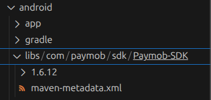
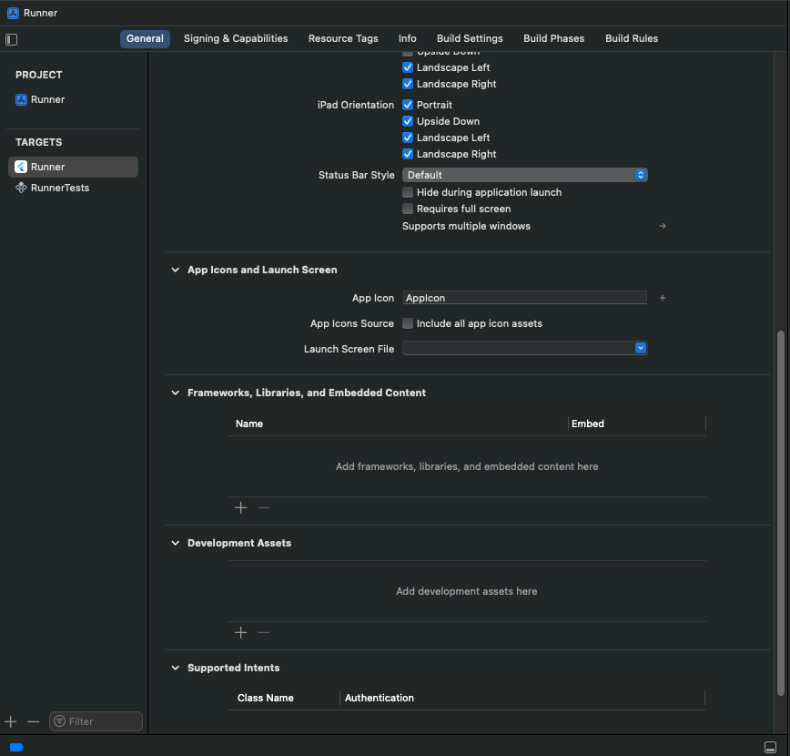
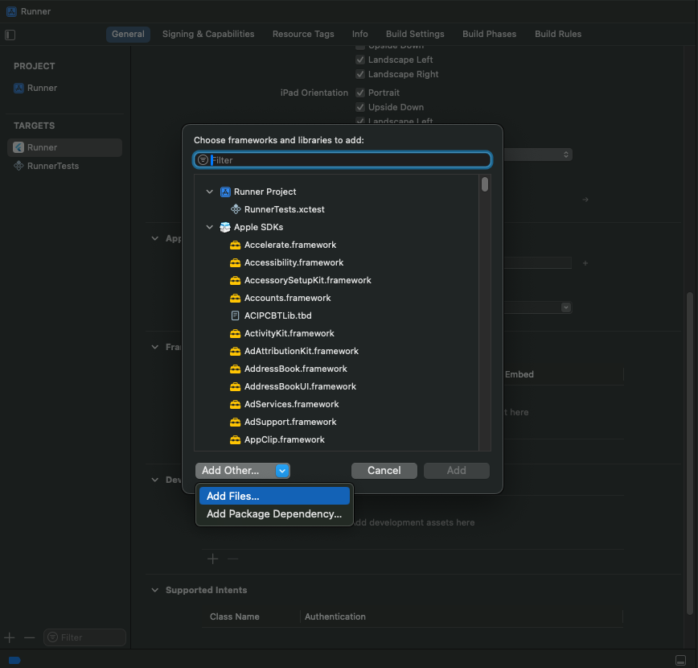
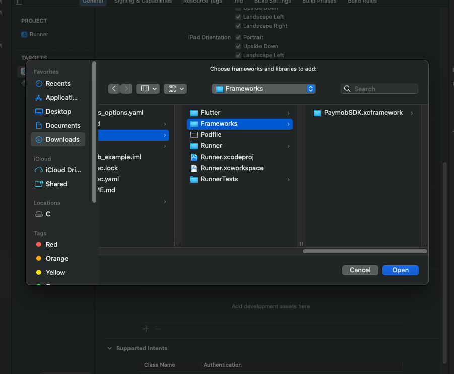

# Paymob Flutter Plugin

A Flutter plugin for integrating Paymob payment SDK into your Flutter applications. This plugin provides a bridge that connects your Flutter app to the native iOS and Android Paymob SDKs.


## Documentation

For detailed Paymob API documentation and integration guides, visit the [Paymob Developer Documentation](https://developers.paymob.com/paymob-docs/developers).


## Requirements

- **Android:** Minimum SDK 23, Compile SDK 33+
- **iOS:** Minimum iOS 13.0, Swift 5.0+

## Installation

Run `flutter pub add paymob`.

## Required Native SDK Versions

Before using this plugin, you must download and configure the native Paymob SDKs:

- **Android SDK:** Version **1.6.12** (required)
- **iOS SDK:** Version **1.2.0** (required)

## Android Setup

**Important:** The Paymob Android SDK is not included in this plugin. You must download and configure **version 1.6.12** in your app.

1. **Download Paymob Android SDK 1.6.12** from [here](https://paymob-my.sharepoint.com/:f:/p/ahmedsobhy/EjQrdOdzUzhIqlQmcsE9Hg0BOVjJYOu2BMGRClGVEa9dJA?e=hfFnnI). Look for `PaymobAndroidSDK1.6.12` in the package.

2. **Add SDK to your app:**
   - Create `android/app/libs/` directory
   - Place the AAR file there: `android/app/libs/com/paymob/sdk/Paymob-SDK/1.6.12/Paymob-SDK-1.6.12.aar`

   

3. **Configure repositories** in `android/build.gradle.kts` (project-level):
   ```kotlin
   allprojects {
       repositories {
           google()
           mavenCentral()
           maven {
               url = uri("https://jitpack.io")
           }
           maven {
               url = rootProject.projectDir.toURI().resolve("libs")
           }
       }
   }
   ```

4. **Configure repositories** in `android/settings.gradle.kts`:
   ```kotlin
   pluginManagement {
       repositories {
           google()
           mavenCentral()
           gradlePluginPortal()
            maven {
               url = uri("https://jitpack.io")
            }
            maven {
               url = rootProject.projectDir.toURI().resolve("libs")
            }
       }
   }
   ```

5. **Add dependency and enable data binding** in `android/app/build.gradle.kts`:
   ```kotlin
   android {
       buildFeatures {
           dataBinding = true
       }
   }
   ```

## iOS Setup

**Important:** The Paymob iOS SDK is not included in this plugin. You must download and configure **version 1.2.0** in your project.

1. **Download Paymob iOS SDK 1.2.0** from [here](https://paymob-my.sharepoint.com/:f:/p/mahmoudyoussef/El9q1ULaxcBFkQurwvXkZQEBY9S-6dwhWL9xXQgjEnGPBQ?e=0sKgCf). Look for `PaymobSDK 1.2.0` (xcframework) in the package.

2. **Add SDK to your project:**
   - Copy the `PaymobSDK.xcframework` folder to your `ios/Frameworks/` directory
   - Create the `ios/Frameworks/` directory if it doesn't exist

3. **Add SDK to Xcode:**
   - Open `ios/Runner.xcworkspace` in Xcode
   - Select **Runner** target → **General** tab
   - Scroll to **Frameworks, Libraries, and Embedded Content**
   
   
   
   - Click **+** → **Add Other...** → **Add Files...**
   - Navigate to `ios/Frameworks/` and select `PaymobSDK.xcframework`
   
   
   
   - Click **Add**
   - Change embedding option to **"Embed & Sign"**
   
   

## Configuration

**Important:** Configure the response callback for your integration ID to:
```
https://accept.paymob.com/api/acceptance/post_pay
```

This ensures after-payment actions are executed based on the actual payment status.

## Usage

### Basic Payment Flow

```dart
import 'package:paymob/paymob.dart';

final result = await Paymob.pay(
  publicKey: 'YOUR_PUBLIC_KEY',
  clientSecret: 'YOUR_CLIENT_SECRET',
);

if (result.isSuccessful) {
  print('Payment successful!');
} else if (result.status == PaymobTransactionStatus.rejected) {
  print('Payment rejected');
} else if (result.status == PaymobTransactionStatus.pending) {
  print('Payment pending');
}
```

### With UI Customization

```dart
final result = await Paymob.pay(
  publicKey: 'YOUR_PUBLIC_KEY',
  clientSecret: 'YOUR_CLIENT_SECRET',
  appName: 'My App Name',
  buttonBackgroundColor: Colors.blue,
  buttonTextColor: Colors.white,
  saveCardDefault: false,
  showSaveCard: true,
);
```

## Testing

When testing your integration, you can use the following test card information:

**Card Information for Testing:**
- **Card Number:** `4987654321098769`
- **Cardholder Name:** `Test Account`
- **Expiry Month:** Any valid month (e.g., 12)
- **Expiry Year:** Any valid year (e.g., 2050)
- **CVV:** `123`

## API Reference

### `Paymob.pay()`

#### Required Parameters
- `publicKey` (String): Your Paymob public key from the dashboard
- `clientSecret` (String): Client secret from the intention creation API

#### Optional Parameters
- `appName` (String?): Custom header name displayed in the SDK
- `buttonBackgroundColor` (Color?): Color of buttons (default: black)
- `buttonTextColor` (Color?): Color of button text (default: white)
- `saveCardDefault` (bool?): Initial value for save card checkbox (default: false)
- `showSaveCard` (bool?): Whether to show save card checkbox (default: true)

#### Returns
`PaymobPaymentResult` with:
- `status`: Transaction status (`PaymobTransactionStatus` enum)
- `transactionDetails`: Map containing transaction details (iOS only)
- `errorMessage`: Error message if something went wrong
- `isSuccessful`: Convenience getter

### Transaction Status

```dart
enum PaymobTransactionStatus {
  successful,  // Payment completed successfully
  rejected,    // Payment was rejected
  pending,     // Payment is pending
  unknown      // Unknown or error status
}
```

## Getting Your Credentials

### Public Key
1. Log in to your [Paymob Dashboard](https://accept.paymob.com/)
2. Go to **Settings** → **Integration Credentials**
3. Find your **Public Key** (remains constant)

### Client Secret
The Client Secret is obtained from the **Create Intention API** request. It changes with each payment transaction.

## License

This project is licensed under the MIT License - see the [LICENSE](LICENSE) file for details.

## Changelog

See [CHANGELOG.md](CHANGELOG.md) for a list of changes.
